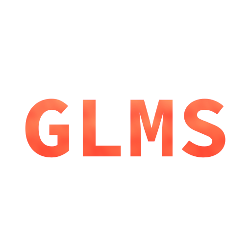

<div align="center" style="text-align: center;">
  
</div>

### Generalized Linear Model Script
> A scripting language focused on linear algebra, heavily inspired by [GLSL](https://en.wikipedia.org/wiki/OpenGL_Shading_Language)
> and [JavaScript](https://en.wikipedia.org/wiki/JavaScript).

> This language comes with types, functions and structures commonly used when doing linear algebra,
> such as: `vec2`, `vec3`, `vec4`, `dot`, `cross`, `lerp`, `sin`, `cos` ...etc

> (There are more to come, and everything is not implemented yet).

### Caution :warning:
> This is a work in progress!

### Building & using it :hammer:
```bash
mkdir build
cd build
cmake .. && make -j8

./glms_e <input_file.gs>
```

## Extensions :electric_plug:
> It's possible to create extensions for `GLMS`,  
> [here](https://github.com/sebbekarlsson/glms-canvas) is an example.  
> This specific extension let's you draw on a "canvas" using OpenGL.
```glsl
import "libglms_canvas.so" as canvasLib;
typedef (canvasLib.canvas) canvas; // we're making a "promise" to the interpreter
                                   // that this type will exist later.

canvas c = canvas(640, 480);

// opens a window, changes can be seen in real-time
c.shade((vec3 uv, vec3 fragCoord, vec3 resolution, number time) => {
    return vec4(0.5 * (0.5 + cos(uv.x*time)), 0.5 * (0.5 + sin(uv.y * time)), cos(time), 1.0);
});
```

## Documentation :open_book:
> To see documentation, built-in functions etc,  
> Have a look at [this](docs/signatures.md)

## Integration
> Want to integrate `GLMS` for scripting in an existing project?  
> Have a look at [this](docs/integration.md)

## Some examples :mag:

### Shader-like image manipulation
```glsl
number w = 640;
number h = 480;

image img = image.make(w, h);

img.shade((vec3 uv, vec3 fragCoord, vec3 resolution) => {
  vec3 center = resolution * 0.5;
  number d = abs(distance(fragCoord, center));
  number g = 255 * (d < TAU * 6.0 * (1.0 + random()));
  vec3 color = mix(vec3(0.1, 0.3, 0.9), vec3(1), g);
  return vec4(color.xyz, 1.0);
});

img.save("test.png");
```

### Functional programming
```glsl
array arr = [1, 2, 3];

array mapped = arr.map((number v) => v * 2);

print(mapped);  // [2.000000, 4.000000, 6.000000]
```

### Vectors
```glsl
vec3 a = vec3(1, 0, 0);
vec3 b = vec3(0, 1, 0);
vec3 c = cross(a, b);

print(c);

vec3 d = vec3(random(), random(), random());

vec3 e = vec3(random(), random(), random());

print(distance(d, e));

vec3 f = vec3(random());

print(f);

number dp = dot(d, f);

print(dp);
```

### Lerp
```glsl
number x = 25.012;
number y = 98.241;

number z = lerp(x, y, 0.1);

print(z); // 32.334900
```

### Clamp
```glsl
number value = 2312.0;
value = clamp(value, 0.0, 1.0);
print(value); // 1.000000
```

### Structs
```glsl
typedef struct {
  number age;
  string name;
} Person;

Person p = Person(33, "John Doe");

print(p.age); // 33.000000
print(p.name); // John Doe
```

### HTTP Requests
```glsl
response r = fetch("https://example.org")

print(r.status()) // 200
print(r.text()) // prints the whole response text

// we can also request json API's
response r = fetch("https://jsonplaceholder.typicode.com/posts");

array p = r.json();

object firstPost = p[0];

print(firstPost.title);
```

### Reading JSON
```glsl
file f = file.open("assets/somefile.json", "r");
string contents = f.read();
f.close();

object data = json.parse(contents);
  
print(data.firstName);
print(data.age);
```

### More examples
> For more examples, see [examples](EXAMPLES.md)

## Syntax highlighting
* [glms-mode for emacs](https://github.com/sebbekarlsson/glms-mode)
